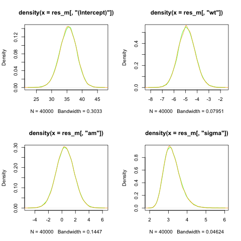
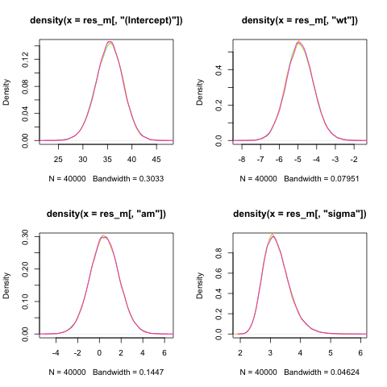

# normal_tf_stan

## normal regression

**keywords: comparison with rstanarm; Normal regression; broadcasting.**

this is just code, needs work.

``` r
################################################################################
# This file fits a Bayesian linear regression (Gaussian) using public data set.
#
# It uses three different R Bayesian libraries:
# 1. rstanarm (assumed the default use case)
# 2. nimble - for comparison
# 3. tensorflow - for comparison
#
# Note: rstanarm does some manipulation (centering and prior adjustment) which
# need reflect in the the other packages
# Documentation is currently very thin and code messy
# chains need longer to run shorter for ease of testing
#
# Many libraries need installed and tensorflow can be problematic
# Once the libraries are installed then the whole file can be sourced
# and the output is "plot_negbin.pdf" which is a comparison of parameter
# estimates
#
# F. Lewis 31-OCT-2025
################################################################################

data(mtcars)

# Rescale
# note for models that do internal predictor centering then need location shift back for intecept
# i.e y = a + b*(x1-mean) + c*(x2-mean)
# so want a at x1=0 and x2=0 so E(y) = mean(a) + mean(b)*-mean(x1) + mean(c)*-mean(x2) etc.
# this centering does not appear to be used in neg bin - as y is counts seem reasonable
# observe lambda*t = a + b + c but want just lambda, i.e. Y=lambda*t so lambda = Y/t
# log(lambda) = a + b + c  + log(exposure)
# P(X=x) = lambda^x exp(-lambda)/x!  lambda = lambda2*t
#

default_prior_test <- stan_glm(mpg ~ wt + am, data = mtcars, chains = 1)

# Estimate original model
glm1 <- glm(mpg ~ wt + am,
            data = mtcars, family = gaussian)
# Estimate Bayesian version with stan_glm
stan_glm1 <- stan_glm(mpg ~ wt + am, data = mtcars, family = gaussian(),
                      prior = normal(0, 2.5),
                      prior_intercept = normal(0, 5),
                      seed = 12345,
                      warmup = 10000,      # Number of warmup iterations per chain
                      iter = 20000,        # Total iterations per chain (warmup + sampling)
                      thin = 1,
                      chains = 4)           # Thinning rate)
res_m<-as.matrix(stan_glm1)
summary(res_m[,"(Intercept)"])
summary(res_m[,"wt"])

prior_scales<-prior_summary(stan_glm1)
# get the predictor adjusted scale - stating priors explicitly so no autoscaling
beta_prior_scale<-prior_scales$prior$scale
# THE ABOVE NEEDS FIXED - if no priors are given this will be incorrect
# note - also hard coded 5 in stan below which needs fixed
#  aux is always re-scaled -next line always needed
sd_prior_scale<-prior_scales$prior_aux$adjusted_scale #need 1/sd_prior_scale for exp

# log(l*n) = a + b, log(l)+log(n) =

################################################################################
## use base rstan
## the below is from gemini
# Load necessary libraries
library(rstan)
library(ggplot2)
library(bayesplot)
library(dplyr) # For data manipulation if needed, e.g., tibble

# Set Stan options for better performance and to avoid recompilation
rstan_options(auto_write = TRUE)
options(mc.cores = parallel::detectCores())

# --- 1. Simulate data for the Negative Binomial Regression Model ---
# (Since no data is provided, we simulate a dataset that matches the description)

set.seed(12345)

# --- Define the Stan model as a string in R ---

stan_model_string <- "
data {
  int<lower=1> N;                 // Number of observations
  int<lower=1> M;                 //number of predictors excl intercept
  array[N] real<lower=0> y;         // Response variable (counts)
  vector[N] wt;           // Continuous predictor
  vector[N] am;    // Binary predictor
  //Hyperparameters
  array[M] real<lower=0>rescaled_sd;// standard dev for predictors

}

transformed data {
  vector[N] wt_centered;
  real mean_wt=mean(wt);
  vector[N] am_centered;
  real mean_am=mean(am);
  wt_centered = wt - mean_wt;  // Center in transformed data block
  am_centered = am - mean_am;
}

parameters {
  real alpha;                     // Intercept
  real beta_wt;               // Coefficient for roach1
  real beta_am;            // Coefficient for treatment
  real<lower=0> phi;              // Negative Binomial overdispersion parameter
}

transformed parameters {
  array[N] real mu;           // Log of the mean parameter
  for (i in 1:N) {
    // linear model
    mu[i] = alpha +
                beta_wt * wt_centered[i] +
                beta_am * am_centered[i] ;
  }
}

model {
  // --- Priors ---
  // Weakly informative priors for coefficients and intercept
  alpha ~ normal(0, 5.0);           // Prior for intercept
  beta_wt ~ normal(0,rescaled_sd[1] );     // Prior for roach1 coefficient
  beta_am ~ normal(0, rescaled_sd[2]);  // Prior for treatment coefficient
  phi ~ exponential(rescaled_sd[3]); // this is actually 1/ rescaled scale

  // --- Likelihood ---
  // Negative Binomial likelihood, using the log-link function for the mean
  y ~  normal(mu, phi);
}

generated quantities {
  // Can include posterior predictions or log-likelihood here if desired for model checking
  real intercept_0;
  intercept_0=alpha + beta_wt*-mean_wt + beta_am*-mean_am;


}
"

# --- 3. Prepare data for Stan ---
# The data needs to be provided as a list for rstan::stan()
stan_data <- list(
  N = nrow(mtcars),
  M = 3, # number of passed hyperpriors
  rescaled_sd=c(beta_prior_scale,1/sd_prior_scale),# 1/ as prior uses rate
  y = mtcars$mpg,
  wt = mtcars$wt,
  am = mtcars$am
)

# --- 4. Fit the Stan model ---
# Use rstan::stan() to compile and sample from the model
fit <- stan(
  model_code = stan_model_string,
  data = stan_data,
  chains = 4,         # Number of MCMC chains
  warmup = 10000,      # Number of warmup iterations per chain
  iter = 20000,        # Total iterations per chain (warmup + sampling)
  thin = 1,           # Thinning rate
  seed = 12345,          # For reproducibility
  control = list(adapt_delta = 0.95, max_treedepth = 15) # Adjust for sampling issues if needed
)

# --- 5. Extract main parameters and produce density plots ---
res2<-extract(fit,par=c("alpha","beta_wt"," beta_am","phi","intercept_0"))
```




