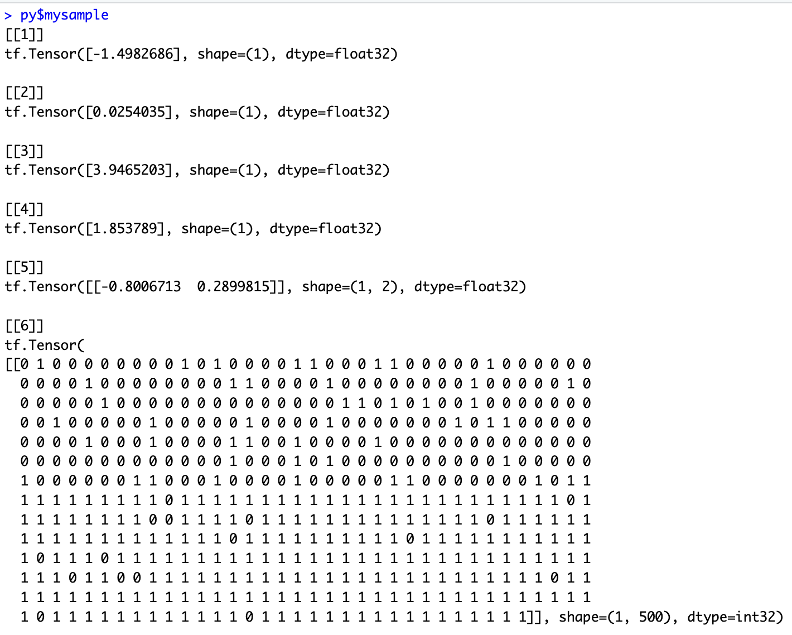

# TFP Basics - simple model building

## Overview

This vignette shows some of the key building blocks in building a
Bayesian model in TFP. It uses a mixture of R and Python. R is used for
data set creation and generation of figures, and Python for model
building in TFP. This is a general theme of the vignettes - R is used
where possible but with Python used when direct interaction with the TFP
API is needed.

In TF and TPF models are written in Python but they use TF tensors as
arguments, rather than more familiar Python structures such as numpy
arrays. This distinction is important as tensors are strongly typed and
so care is needed, including when moving back and forth to R via
reticulate.

## Make data available to TFP models

Assuming the data to be modelled, i.e. the source data from which
parameters are to be estimates via model fitting, are loaded into R or
generated in R then a first step is to make these data available to TFP.
This functionality is readily provided by
[reticulate](https://rstudio.github.io/reticulate/), the only watch out
is that the Python pandas library is required to deal with data.frames
(see installation instructions - pandas can be included as part of
Rstudio’s tfprobability install script).

### Example data set

The R chunk below creates a simple dataset of three cols:

- a binary response variable (0/1 = non-responder/responder),
- a binary treatment variable (0/1 = control/test treatment)
- and a basket ID variable. (1)

The basket ID is currently set fixed 1, denoting there is only one
basket in this trial, i.e. a classical two arm randomized trial design.
Baskets will be added in other vignettes.

``` r
### Prepare model inputs
set.seed(9999)
# Set up data
rr_k_ctrl <- c(0.60)        # control response rate for each basket
rr_k_trt <- c(0.58)         # treatment response rate for each basket

K<-length(rr_k_ctrl)        # number of baskets

N_k_ctrl <- rep(250, K)     # number of control participants per basket
N_k_trt <- rep(250, K)      # number of treatment participants per basket
N_k <- N_k_ctrl + N_k_trt         # number of participants per basket (both arms combined)
N <- sum(N_k)                     # total sample size
k_vec <- rep(1:K, N_k)            # N x 1 vector of basket indicators (1 to K)

z_vec<-NULL;
y<-NULL;
for(i in 1:K){ # for each basket repeat 0-control 1-trt inside this according to the specifc Ns
  z_vec<-c(z_vec,rep(0:1,c(N_k_ctrl[i],N_k_trt[i]))) # treatment/control indicator
  y<-c(y,
       c(rbinom(N_k_ctrl[i],1,rr_k_ctrl[i]), # bernoulli for control
         rbinom(N_k_trt[i],1,rr_k_trt[i]))) #           for trt
}

thedata<-data.frame(y,basketID=k_vec,Treatment=z_vec)

py$thedata<-r_to_py(thedata) # THE KEY LINE - makes data available to Python 
```

|   y | basketID | Treatment |
|----:|---------:|----------:|
|   0 |        1 |         0 |
|   0 |        1 |         0 |
|   0 |        1 |         0 |
|   1 |        1 |         0 |
|   0 |        1 |         0 |
|   0 |        1 |         0 |

## Python setup

In this Python chunk we load in the necessary libraries for TFP

``` python
import numpy as np
import pandas as pd
import os
import keras
import tensorflow as tf
import tensorflow_probability as tfp
from tensorflow_probability import distributions as tfd
tfb = tfp.bijectors
import warnings
import time
import sys
#print(sys.version)
#print(sys.executable)
#print(f"TensorFlow version:            {tf.__version__}")
#print(f"TensorFlow Probability version: {tfp.__version__}")

#print(f" rows={thedata.shape[0]} cols={thedata.shape[1]}")

y_data=tf.convert_to_tensor(thedata.iloc[:,0], dtype = tf.float32)
k_vec=tf.convert_to_tensor(thedata.iloc[:,1], dtype = tf.float32)
z_vec=tf.convert_to_tensor(thedata.iloc[:,2], dtype = tf.float32)

#print(f"y={z_vec}")
```

## Define the Probability Model

This chunk defines the joint probability distribution for our model,
i.e., the data likelihood and all the prior densities.

``` python
def make_observed_dist(log_odd_control_and_ratio,sigma1, mu1,sigma0,mu0):
    beta=tf.stack([mu0 + sigma0 * log_odd_control_and_ratio[0],
                   mu1 + sigma1 * log_odd_control_and_ratio[1]])
    return(tfd.Independent(
        tfd.Bernoulli(logits=beta[0]+beta[1]*z_vec),
        reinterpreted_batch_ndims = 1
    ))
    
# model is y[i] = Bernoulli(p[i]) where logit(p[i]) = intercept + treatment*z[i]
model = tfd.JointDistributionSequentialAutoBatched([
  tfd.Normal(loc=0., scale=2.5, name="mu0"),  # `mu_b` stan above
  tfd.HalfNormal(scale=2.5, name="sigma0"),  # `tau_b` stan above
  tfd.Normal(loc=0., scale=2.5, name="mu1"),  # `mu` stan above
  tfd.HalfNormal(scale=2.5, name="sigma1"),  # `tau` stan above
  tfd.Normal(loc=tf.zeros(2), scale=tf.ones(2), name="log_odd_control_and_ratio"), ## indep norms, vector
  make_observed_dist
])   

mysample=model.sample(1)
```



``` python
def log_prob_fn(mu0, sigma0, mu1,sigma1, log_odd_control_and_ratio):
  """Unnormalized target density as a function of states."""
  return model.log_prob((
      mu0, sigma0, mu1,sigma1, log_odd_control_and_ratio,y_data))
 
```
