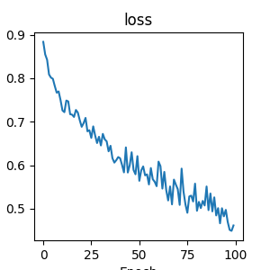
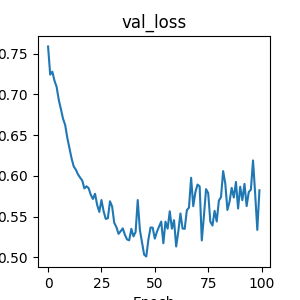

# tf_gnn_example

``` r
#library(tfclinical)
library(ragg)
library(reticulate)
use_virtualenv("/Users/work/gnn", required = TRUE)
# 1. Set the device to 'png' (which both R and Python understand)
knitr::opts_chunk$set(dev = "png")

# 2. Tell R to use ragg as the default engine for all png devices
options(device = function(...) ragg::agg_png(...))
```

## Graphical Neural Network Model

this requires a custom python venv setup to ensure correct version
compatibility. See installation guide under advanced.

This example is ported from the [original on Tensorflow GNN github
site](https://colab.research.google.com/github/tensorflow/gnn/blob/master/examples/notebooks/intro_mutag_example.ipynb)

Needs compatible versions (installed via pip in venv hard coding
versions):

- Name: tf_keras
  - Version: 2.16.0
- Name: tensorflow
  - Version: 2.16.2
- Name: tensorflow-gnn
  - Version: 1.0.3

``` python
import os
os.environ["TF_USE_LEGACY_KERAS"] = "1"  # For TF2.16+.

import matplotlib.pyplot as plt
import numpy as np
import tensorflow as tf
import tensorflow_gnn as tfgnn

print(f'Running TF-GNN {tfgnn.__version__} with TensorFlow {tf.__version__}.')


train_path = os.path.join(os.getcwd(), 'precomputed/mutag', 'train.tfrecords')
val_path = os.path.join(os.getcwd(), 'precomputed/mutag', 'val.tfrecords')
#get_ipython().system('ls -l {train_path} {val_path}')

print(f" the train path={train_path}")
#exit()


graph_tensor_spec = tfgnn.GraphTensorSpec.from_piece_specs(
    context_spec=tfgnn.ContextSpec.from_field_specs(features_spec={
                  'label': tf.TensorSpec(shape=(1,), dtype=tf.int32)
    }),
    node_sets_spec={
        'atoms':
            tfgnn.NodeSetSpec.from_field_specs(
                features_spec={
                    tfgnn.HIDDEN_STATE:
                        tf.TensorSpec((None, 7), tf.float32)
                },
                sizes_spec=tf.TensorSpec((1,), tf.int32))
    },
    edge_sets_spec={
        'bonds':
            tfgnn.EdgeSetSpec.from_field_specs(
                features_spec={
                    tfgnn.HIDDEN_STATE:
                        tf.TensorSpec((None, 4), tf.float32)
                },
                sizes_spec=tf.TensorSpec((1,), tf.int32),
                adjacency_spec=tfgnn.AdjacencySpec.from_incident_node_sets(
                    'atoms', 'atoms'))
    })


def decode_fn(record_bytes):
  graph = tfgnn.parse_single_example(
      graph_tensor_spec, record_bytes, validate=True)

  # extract label from context and remove from input graph
  context_features = graph.context.get_features_dict()
  label = context_features.pop('label')
  new_graph = graph.replace_features(context=context_features)

  return new_graph, label


# In[7]:


train_ds = tf.data.TFRecordDataset([train_path]).map(decode_fn)
val_ds = tf.data.TFRecordDataset([val_path]).map(decode_fn)


# ### Look at one example from the dataset

# In[8]:


g, y = train_ds.take(1).get_single_element()


# #### Node features
# 
# Node features represent the 1-hot encoding of the atom type (0=C, 1=N, 2=O, 3=F,
# 4=I, 5=Cl, 6=Br).

# In[9]:


print(g.node_sets['atoms'].features[tfgnn.HIDDEN_STATE])


# #### Bond Edges
# 
# In this example, we consider the bonds between atoms undirected edges. To encode
# them in the GraphsTuple, we store the undirected edges as pairs of directed
# edges in both directions.
# 
# `adjacency.source` contains the source node indices, and `adjacency.target` contains the corresponding target node indices.

# In[10]:


g.edge_sets['bonds'].adjacency.source


# In[11]:


g.edge_sets['bonds'].adjacency.target


# #### Edge features
# 
# Edge features represent the bond type as one-hot encoding.

# In[12]:


g.edge_sets['bonds'].features[tfgnn.HIDDEN_STATE]


# ### Label
# The label is binary, indicating the mutagenicity of the molecule. It's either 0 or 1.

# In[13]:


y
```

``` python
#for k, hist in history.history.items():
#  plt.plot(hist)
#  plt.title(k)
#  plt.show()
for k, hist in history.history.items():
    plt.figure()  # Create a new figure for each metric
    plt.plot(hist)
    plt.title(k)
    plt.xlabel('Epoch')
    plt.ylabel(k)
    
    # Save the plot. Using f-strings to name the file based on the key (e.g., loss.png)
    plt.savefig(f"precomputed/pyplot_{k}.png")
    
    # Optional: If you want to show it in the console while running
    # plt.show() 
    
    plt.close() 
    

# Feel free to play with the hyperparameters and the model architecture to improve the results!
```

## the end


