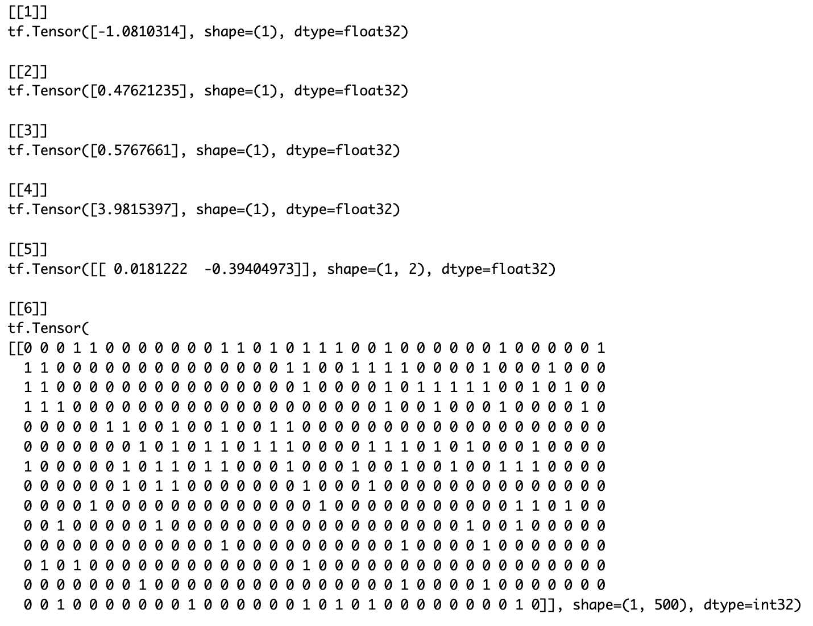
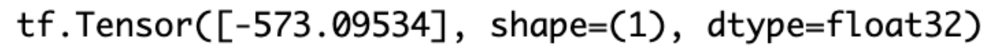
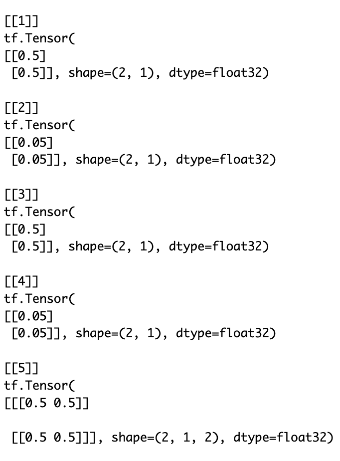
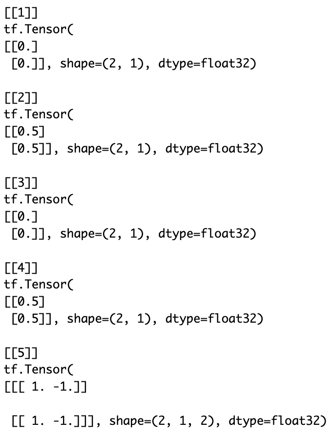
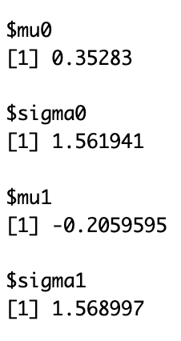
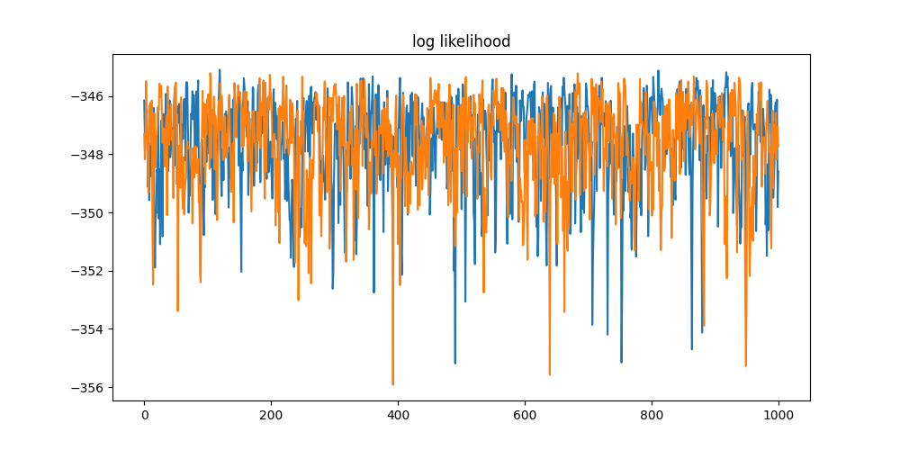
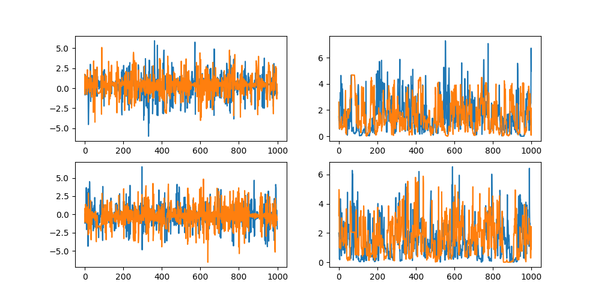

```{r, include = FALSE}
knitr::opts_chunk$set(
  collapse = TRUE,
  comment = "#>"
)

# Check if running on GitHub Actions
# This is important as otherwise Github will attempt to build this and it's missing the python libraries and will fail
#on_github <- Sys.getenv("GITHUB_ACTIONS") == "true"

# If on GitHub, set eval = FALSE for all subsequent chunks
#knitr::opts_chunk$set(eval = !on_github)

```
## Quick start
This vignettes shows: 

  - how to easily pass data sets from R to TFP (Python)
  - how to build a simple hierarchical Bayesian model 
     - setup the priors
     - define the log-likelihood
  - how to generate samples from the model
  - how to write a function to compute the log_posterior (needed for MCMC sampling)
   
The model used here is for a two arm clinical trial and is written such that it can readily be expanded to multiple sets of arms (basket trial). 

The full .Rmd file to generate all the outputs shown here can is [here](https://github.com/fraseriainlewis/tfclinical/blob/main/assets/fullcodevignettes/intro_model_build.orig.Rmd). 

## Overview
This vignette shows some of the key building blocks in building a Bayesian hierarchical (HM) model in TFP. The model considered is for a basket trial design - a clinical trial where the same drug is used to treat different indications within the same master protocol. Using Bayesian HM approach some pooling/borrowing is possible between baskets to help improve the power of detecting true treatment differences. 

Technically the model used in this vignette is not a basket trial because it only contains one basket, and so is a conventional two arm test v control trial. We are referring to it as a basket trial as the code is structured such that additional baskets can be easily added (see later vignettes). Only one basket is used to keep this as simple as possible to allow focus for now on the TPF building modelling blocks.   


This vignette shows some of the key building blocks in building a Bayesian model in TFP. It uses a mixture of R and Python Rmarkdown cells. R is used for data set creation and generation of figures, and Python for model building in TFP. This is a general theme of the vignettes; Python is used when direct interaction with the TFP API is needed, otherwise R is used as the assumed go-to language of choice for statisticians.

### Example Model - Formulation
The model implemented here is a into TPF code is the following non-centered parameterization for a logistic model.

$$
\begin{aligned}
\mu_0 &\sim \text{Normal}(0, 2.5)\\
\sigma_0 &\sim \text{Half-Normal}(0, 2.5) \\
\mu_1 &\sim \text{Normal}(0, 2.5) \\
\sigma_1 &\sim \text{Half-Normal}(0, 2.5) \\
\tilde{\theta}_j &\sim \text{Normal}(0, 1)\quad\enspace\text{for}\enspace{j=1,2}  \\
\beta_0 &= \mu_0 + \sigma_0 \tilde{\theta}_1 \\
\beta_1 &= \mu_1 + \sigma_1 \tilde{\theta}_2 \\
\text{logit(}{p_i}) &= \beta_0 + \beta_1 z_i\quad\quad\enspace\enspace\text{for}\enspace{i=1,\dots,N}  \\
y_i &\sim \text{Bernoulli}(p_i)
\end{aligned}
$$


```{r rsetup, include=FALSE,eval=FALSE}
#library(tfclinical)
library(tfprobability)
library(reticulate)
library(kableExtra)
#reticulate::py_install("bash") # just a test
```
## Make data available to TFP models
Assuming the data to be modelled, i.e. the source data from which parameters are to be estimates via model fitting, are loaded into R or generated in R then a first step is to make these data available to TFP. This functionality is readily provided by [reticulate](https://rstudio.github.io/reticulate/), with one watchout - the Python `pandas` library is required to deal with data.frames (see installation instructions - pandas can be included as part of Rstudio's tfprobability install script).

In TF and TPF models are written in Python but they use TF tensors as arguments, rather than more familiar Python structures such as numpy arrays. This distinction is important as tensors are strongly typed and so care is needed, including when moving back and forth to R via reticulate.

### Example data set
The R chunk below creates a simple dataset of three cols:

 - a binary response variable (0/1 = non-responder/responder),
 - a binary treatment variable (0/1 = control/test treatment)
 - and a basket ID variable. (1)

The basket ID is currently set fixed 1, denoting there is only one basket in this trial, i.e. a classical two arm randomized trial design. Baskets will be added in other vignettes.


```{r datasets, include=TRUE,eval=FALSE}
### Prepare model inputs
set.seed(9999)
# Set up data
rr_k_ctrl <- c(0.60)        # control response rate for each basket
rr_k_trt <- c(0.58)         # treatment response rate for each basket

K<-length(rr_k_ctrl)        # number of baskets

N_k_ctrl <- rep(250, K)     # number of control participants per basket
N_k_trt <- rep(250, K)      # number of treatment participants per basket
N_k <- N_k_ctrl + N_k_trt   # number of participants per basket (both arms combined)
N <- sum(N_k)               # total sample size
k_vec <- rep(1:K, N_k)      # N x 1 vector of basket indicators (1 to K)

z_vec<-NULL;
y<-NULL;
for(i in 1:K){ # for each basket repeat 0-control 1-trt according to the specifc Ns
  z_vec<-c(z_vec,rep(0:1,c(N_k_ctrl[i],N_k_trt[i]))) # treatment/control indicator
  y<-c(y,
       c(rbinom(N_k_ctrl[i],1,rr_k_ctrl[i]), # bernoulli for control
         rbinom(N_k_trt[i],1,rr_k_trt[i]))) #           for trt
}

thedata<-data.frame(y,basketID=k_vec,Treatment=z_vec)

py$thedata<-r_to_py(thedata) # THE KEY LINE - makes data available to Python
                             # this is converted into a pandas dataframe object in Python
```

```{r datasetsQ, include=FALSE,eval=FALSE}
my_table1_object <- head(thedata) %>%
  kable() %>%
  kable_styling(full_width = F) %>%
  column_spec(1, bold = T, color = "blue")

# Save the object
saveRDS(my_table1_object, "precomputed/table1.rds")

```

```{r tableoutput,include=TRUE,echo=FALSE,eval=TRUE}
saved_table1 <- readRDS("precomputed/table1.rds")
saved_table1
```

## Setup python and get data from R
We first load in the necessary libraries for TFP and then convert the dataset passed from R into tensors. Note that as tensors are strongly typed we explicitly define the storage type.
```{python pysetup,include=TRUE,eval=FALSE}
import numpy as np
import pandas as pd
import os
import keras
import tensorflow as tf
import tensorflow_probability as tfp
from tensorflow_probability import distributions as tfd
tfb = tfp.bijectors
import warnings
import time
import sys

## The data.frame passed is now a panda df but for TPF this needs to be further
## converted into tensors here we simply convert each col of the data.frame into
## a Rank 1 tensor (i.e. a vector)
y_data=tf.convert_to_tensor(thedata.iloc[:,0], dtype = tf.float32)
k_vec=tf.convert_to_tensor(thedata.iloc[:,1], dtype = tf.float32)
z_vec=tf.convert_to_tensor(thedata.iloc[:,2], dtype = tf.float32)

#print(f"y={z_vec}") #if using locally this prints out to R console
```

## Defining the Model
We now fully define our model, i.e., the data likelihood and all the prior densities. We use a TFP function called JointDistributionSequentialAutoBatched. The are a number of alternative TFP functions for defining Bayesian models. This is one of the simplest but still capable of defining complex models. The model definition in JointDistributionSequentialAutoBatched **must follow a strict convention** which is explained in the comments.

As above the model formulation here uses a non-centered approach to aim with MCMC estimation as discussed in the stan manual [here](https://mc-stan.org/learn-stan/case-studies/divergences_and_bias.html).

### Define the likelihood
```{python definelogL,include=TRUE,eval=FALSE}
# Define LIKELIHOOD - this is defined first, as functions need defined before used
# The arguments in our function are in the REVERSE ORDER that the parameters
# appear in JointDistrbutionSequential this is essential
def make_observed_dist(log_odd_control_and_ratio,sigma1, mu1,sigma0,mu0):
    # beta is a two element tensor, beta[0] parameter for the log odds of the control arm effect
    #                               beta[1] log odds ratio of treatment to control
    beta=tf.stack([mu0 + sigma0 * log_odd_control_and_ratio[0],
                   mu1 + sigma1 * log_odd_control_and_ratio[1]])
                   #tf.stack is used to stack tensors without creating new tensors

    # return a vector of Bernoulli probabilities, one for each patient, and these estimates
    # dependent on which arm the patient was randomized to, i.e. two unique values
    return(tfd.Independent(
        tfd.Bernoulli(logits=beta[0]+beta[1]*z_vec), #define as logits
        reinterpreted_batch_ndims = 1 # This tells TFP that log_prob here is a single value
                                      # equal to sum of individual log_probs, a vector
                                      # this is usual when defining a data likelihood
    ))
```

### Define the full model
This is straightforward provided it's done in sequence. Care is needed in understanding whether parameters are scalars or vectors, especially in more complex models which feature a design matrix and matrix algebra. Simulating a realization from the model is a simple way to see what the structure of the *state* variable of the model is. In more complex models simulating multiple values is useful to check the structure is as expected.
```{python definejoint,include=TRUE,eval=FALSE}
# DEFINE FULL MODEL - hyperparams hard coded
# model is y[i] = Bernoulli(p[i]) where logit(p[i]) = intercept + treatment*z[i]
model = tfd.JointDistributionSequentialAutoBatched([
  tfd.Normal(loc=0., scale=2.5, name="mu0"),  # prior for mean of control arm log odds
  tfd.HalfNormal(scale=2.5, name="sigma0"),   # prior for sd of control arm log odds
  tfd.Normal(loc=0., scale=2.5, name="mu1"),  # prior for mean of treatment log odds ratio
  tfd.HalfNormal(scale=2.5, name="sigma1"),   # prior for sd of treatment log odds ratio
  # now come to the standard normals resulting from non-centred parameterization
  # define these as vector MVN with identity scale matrix
  tfd.Normal(loc=tf.zeros(2), scale=tf.ones(2), name="log_odd_control_and_ratio"),
  # now finally define the likelihood as we have already defined parameters in this
  make_observed_dist # the data likelihood defined as a function above
])

tf.random.set_seed(9999)
# Sample one variate from this joint probability model - shows what structure the model
# produces/needs. i.e. what the state variable of the model looks like in TF
mysample=model.sample(1) # 1 = one random variate
print(f"{mysample}")

```

```{r sampleout,include=TRUE,echo=TRUE,eval=FALSE}
print(py$mysample)

```

```{r vg1_table2, include=TRUE,echo=FALSE,out.width="100%", fig.align="center",eval=TRUE}

```

### Define the log_prog_fn
To use the various MCMC samplers provided in TFP we need to explicitly provide a function which returns the log of the posterior density. This is straightforward and simply involves wrapping around the existing model method log_prob() as seen below.
```{python log_prob1,include=TRUE,eval=FALSE}
# the ordering of the arguments in this must match exactly the ordering used in
# JointDistributionSequentialAutoBatched
def log_prob_fn(mu0, sigma0, mu1,sigma1, log_odd_control_and_ratio):
  return model.log_prob((
      mu0, sigma0, mu1,sigma1, log_odd_control_and_ratio,y_data))
                                                         ## last argument is the DATA (y)

# useful to see how to call this. We use the simulated values above
mylogp=log_prob_fn(mysample[0], mysample[1], mysample[2],mysample[3], mysample[4])
```

```{r sampleout2,include=TRUE,echo=TRUE,eval=FALSE}
print(py$mylogp)

```

```{r text_image1, include=TRUE,echo=FALSE,out.width="50%", fig.align="center",eval=TRUE}

```
## Setup the MCMC Sampler
TPF generally has a lower level inference to MCMC sampler routines than compared to Stan, and as such requires a few more manual steps. There are also a range of different ways to setup the samplers. The API is evolving so that higher level functions are steadily being introduced.

### NUTS and Adaptive-Step Size
We use here a No-u-turn sampler, and add into this with dual step size adaptation for efficiency. To set this up we need to do the following:

  - Define the bijectors needed for each parameter in the model (as NUTS requires unconstrained mappings)
  - Define tensors in a specific way such that we allow:
       - each parameter to have it's own step size adaptation
       - additionally allow this tuning to be done independently for each chain
  
The following code sets this up. The precise tensor structure needed can require some trial and error. It has to be carefully specified as the structure tells TF how to arrange the calculations, both in terms of computational efficiency (parallelization wherever possible) and also at what level (parameter, chain, parameter*chain) to perform step size adaptation.

```{python bijectorandsteps,eval=FALSE}
# bijectors which define the mapping from **unconstrained space to target space**
# i.e. Exp() is used for scale as this maps R -> R+
unconstraining_bijectors = [
    tfb.Identity(),  # mu0
    tfb.Exp(),       # sigma0
    tfb.Identity(),  # mu1
    tfb.Exp(),       # sigma0
    tfb.Identity()  # log_odd_control_and_ratio - this is a vector parameter
]

## Adaptive step size.
## Do in two parts, first a structure to allow step size to adapt separately for
## each parameter
steps=[tf.constant([0.5]),                # mu0
        tf.constant([0.05]),              # sigma0
        tf.constant([0.5]),               # mu1
        tf.constant([0.05]),              # sigma1
        tf.constant([[0.5,0.5]]) # log_odd_control_and_ratio
                                 # NOTE - vector and must have correct shape
        ]

## now we replicate the above "steps" array into a structure where this is
## repeated inside each chain
n_chains=2 ## THIS SETS NUMBER OF CHAINS 
steps_chains = [tf.expand_dims(tf.repeat(steps[0],repeats=n_chains,axis=-1),axis=-1), # starts with shape (1,)
                 tf.expand_dims(tf.repeat(steps[1],repeats=n_chains,axis=-1),axis=-1), # starts with shape (1,)
                 tf.expand_dims(tf.repeat(steps[2],repeats=n_chains,axis=-1),axis=-1), # starts with shape (1,)
                 tf.expand_dims(tf.repeat(steps[3],repeats=n_chains,axis=-1),axis=-1), # starts with shape (1,)
                 tf.expand_dims(tf.tile(steps[4],[n_chains,1]),axis=1) # starts with shape (1,2) i.e. [[a, b]]
                 ]
                 
```

```{r sampleout3,include=TRUE,echo=TRUE,eval=FALSE}
print(py$steps_chains)

```

```{r text_image2, include=TRUE,echo=FALSE,out.width="50%", fig.align="center",eval=TRUE}

```

### NUTS definition
Now define the NUTS sampler, which needs several steps: 
   - define the parameters to the NUTS sampler, 
   - then wrap this inside the TransformedTransitionKernel which tells NUTS what transformations (bijectors - as defined above) to use
   - then wrap the NUTS and TransformedTransitionKernel inside the adaptive step size routine
   

   
```{python samplerdef,eval=FALSE}

num_results=1000 # number of steps to run each chain for AFTER burn-in
num_burnin_steps=100 # this is discarded (currently not other option in TPF)

mysampler=tfp.mcmc.NoUTurnSampler(
                                     target_log_prob_fn=log_prob_fn,
                                     max_tree_depth=15, # default is 10
                                     max_energy_diff=1000.0, # default do not change
                                     step_size=steps_chains
                                     )
                          
sampler = tfp.mcmc.TransformedTransitionKernel( # inside this the starting conditions must be on 
                                                # original scale i.e. precisions must be >0
    mysampler,
    bijector=unconstraining_bijectors
    )

## define final sampler - NUTS, bijectors and adaptation
adaptive_sampler = tfp.mcmc.DualAveragingStepSizeAdaptation(
    inner_kernel=sampler,
    num_adaptation_steps=int(0.8 * num_burnin_steps),
    reduce_fn=tfp.math.reduce_logmeanexp, # default - this determines how to change the step 
                                          # adaptation across chains
    #reduce_fn=tfp.math.reduce_log_harmonic_mean_exp, # might be better if difficult chains
    target_accept_prob=tf.cast(0.95, tf.float32)) # this is a key parameter to get good mixing

```

## Define starting point for chains
Explicit initial conditions are needed for each parameter in each chain. This is currently done very simply via hard coding. See Stan manual for a fairly simple way to generate random conditions that often works well. The key point here is that the initial conditions must be again in a strict tensor structure. 

```{python initstate,eval=FALSE}
istate=[tf.constant([0.0]),
        tf.constant([0.5]),
                   tf.constant([0.0]),
        tf.constant([0.5]),
        tf.constant([[1.,-1.]])]

current_state = [tf.expand_dims(tf.repeat(istate[0],repeats=n_chains,axis=-1),axis=-1), # starts with shape (1,)
                 tf.expand_dims(tf.repeat(istate[1],repeats=n_chains,axis=-1),axis=-1), # starts with shape (1,)
                 tf.expand_dims(tf.repeat(istate[2],repeats=n_chains,axis=-1),axis=-1), # starts with shape (1,)
                 tf.expand_dims(tf.repeat(istate[3],repeats=n_chains,axis=-1),axis=-1), # starts with shape (1,)
                 tf.expand_dims(tf.tile(istate[4],[n_chains,1]),axis=1) # starts with shape (1,2) i.e. [[a, b]]
                 ]
print(current_state)
```
```{r sampleout4,include=TRUE,echo=TRUE,eval=FALSE}
print(py$current_state)

```

```{r text_image3, include=TRUE,echo=FALSE,out.width="50%", fig.align="center",eval=TRUE}

```
## Perform MCMC Sampling
We are now in a position to actually sample from our model, but first we will set up a tracer function which is called at every step. This can be used either for diagnostics, such as monitor step-size changes, or else to generate custom output, such as compute loglikelihood at each step. Such a function can be computationally expensive and so it's a trade-off as to whether to wait until the samples have been generated to compute additional functions of the parameters of interest.

```{python trace_fn,eval=FALSE}
def trace_fn(state, pkr):
    return {
        'sample': state, # this is also pkr['all'][0].transformed_state[0]
        'step_size': pkr.new_step_size,  # <--- THIS extracts the adapted step size
        'all': pkr, #state is also pkr['all'][0].transformed_state[0]
        #pkr is a named tuple with ._fields = ('transformed_state', 'inner_results')
        # 'transformed_state is the state
        # 'inner_results' is diagnostics
        # ('target_log_prob', 'grads_target_log_prob', 'step_size', 'log_accept_ratio', 'leapfrogs_taken',                     'is_accepted', 'reach_max_depth', 'has_divergence', 'energy', 'seed')
        'has_divergence':pkr[0].inner_results.has_divergence,
        'logL': log_prob_fn(state[0], state[1],state[2],state[3],state[4])
    }

```

Now run the actual sampler. The number of steps and burn-in were defined above when we setup the NUTS sampler. 
```{python mcmcsampling,eval=FALSE}
# Speed up sampling by tracing with `tf.function`.
@tf.function(autograph=False, jit_compile=True,reduce_retracing=True)
def do_sampling():
  return tfp.mcmc.sample_chain(
      kernel=adaptive_sampler,
      current_state=current_state,
      num_results=num_results,
      num_burnin_steps=num_burnin_steps,
      seed= tf.constant([9999, 9999], dtype=tf.int32), # this is random seed
      trace_fn=trace_fn)


t0 = time.time()
#samples, kernel_results = do_sampling()
samples, traceout = do_sampling()
#res = do_sampling()
#[mu0, sigma0, mu1, sigma1,log_odds_control_and_ratio], results = do_sampling() 
t1 = time.time()
print("Inference ran in {:.2f}s.".format(t1-t0))

## there is a trailing dimension of 1 so need to squeeze to get each col is chain, and each row is parameter sample
samplesflat = list(map(lambda x: tf.squeeze(x).numpy(), samples))
print(f" means for mu0, sigma0, mu1, sigma1\n")
themeans=[np.mean(row) for row in samplesflat[0:4]]


```
```{r sampleout5,include=TRUE,echo=TRUE,eval=FALSE} 
names(py$themeans)<-c("mu0","sigma0","mu1","sigma1")
print(py$themeans)

```

```{r text_image4, include=TRUE,echo=FALSE,out.width="25%", fig.align="center",eval=TRUE}

```

```{python outputs1,eval=FALSE}
import matplotlib.pyplot as plt
plt.figure(figsize=(10, 5))
plt.plot(tf.squeeze(traceout['logL'].numpy()))
plt.title("log likelihood")
plt.savefig(f"precomputed/vg1_loglike.png")
plt.show()

```
```{r vg1_mcmcplots1, include=TRUE,echo=FALSE, fig.align="center",out.width="80%",eval=TRUE}

```

```{python outputs2,eval=FALSE}
fig, axes = plt.subplots(2, 2)#, sharex='col', sharey='col')
fig.set_size_inches(10, 5)
axes[0][0].plot(samplesflat[0]) # mu_b
axes[0][1].plot(samplesflat[1]) # tau_b
axes[1][0].plot(samplesflat[2]) # mu
axes[1][1].plot(samplesflat[3]) # tau
plt.savefig(f"precomputed/vg1_traces.png")
plt.show()

```
```{r vg1_mcmcplots2, include=TRUE,echo=FALSE, fig.align="center",out.width="80%",eval=TRUE}

```


