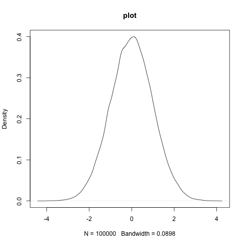

```{r, include = FALSE}
knitr::opts_chunk$set(
  collapse = TRUE,
  comment = "#>"
)

# Check if running on GitHub Actions
# This is important as otherwise Github will attempt to build this and it's missing the python libraries and will fail
#on_github <- Sys.getenv("GITHUB_ACTIONS") == "true"

# If on GitHub, set eval = FALSE for all subsequent chunks
#knitr::opts_chunk$set(eval = !on_github)

```

```{r rsetup, include=FALSE}
#library(tfclinical)
library(tfprobability)
library(reticulate)
#reticulate::py_install("bash") # just a test
```
## Dataset 
```{r datasets, include=TRUE,eval=FALSE}
### Prepare model inputs
set.seed(9999)
# Set up data
rr_k_ctrl <- c(0.60)       # control response rate for each basket
rr_k_trt <- c(0.58)        # treatment response rate for each basket

K<-length(rr_k_ctrl)             # number of baskets

N_k_ctrl <- rep(250, K)     # number of control participants per basket
N_k_trt <- rep(250, K)      # number of treatment participants per basket
N_k <- N_k_ctrl + N_k_trt         # number of participants per basket (both arms combined)
N <- sum(N_k)                     # total sample size
k_vec <- rep(1:K, N_k)            # N x 1 vector of basket indicators (1 to K)

z_vec<-NULL;
y<-NULL;
for(i in 1:K){ # for each basket repeat 0-control 1-trt inside this according to the specifc Ns
  z_vec<-c(z_vec,rep(0:1,c(N_k_ctrl[i],N_k_trt[i]))) # treatment/control indicator
  y<-c(y,
       c(rbinom(N_k_ctrl[i],1,rr_k_ctrl[i]), # bernoulli for control
         rbinom(N_k_trt[i],1,rr_k_trt[i]))) #           for trt
}

thedata<-data.frame(y,basketID=k_vec,Treatment=z_vec)
knitr::kable(head(thedata)) 
py$thedata<-r_to_py(thedata) # to ensure correct form to python

```

```{python pysetup,include=TRUE,eval=FALSE}
import matplotlib.pyplot as plt
import seaborn as sns
import numpy as np
import pandas as pd
import os
#os.environ["KERAS_BACKEND"] = "jax"
import keras
#import bash
import tensorflow as tf
import tensorflow_probability as tfp
from tensorflow_probability import distributions as tfd
tfb = tfp.bijectors
import warnings
import time
import sys
print(sys.version)
print(sys.executable)
print(f"TensorFlow version:            {tf.__version__}")
print(f"TensorFlow Probability version: {tfp.__version__}")

print(f" rows={thedata.shape[0]} cols={thedata.shape[1]}")

y_data=tf.convert_to_tensor(thedata.iloc[:,0], dtype = tf.float32)
k_vec=tf.convert_to_tensor(thedata.iloc[:,1], dtype = tf.float32)
z_vec=tf.convert_to_tensor(thedata.iloc[:,2], dtype = tf.float32)

print(f"y={z_vec}")

```


```{python definemodel,include=TRUE,eval=FALSE}
def make_observed_dist(log_odd_control_and_ratio,sigma1, mu1,sigma0,mu0):
    beta=tf.stack([mu0 + sigma0 * log_odd_control_and_ratio[0],
                   mu1 + sigma1 * log_odd_control_and_ratio[1]])
    return(tfd.Independent(
        tfd.Bernoulli(logits=beta[0]+beta[1]*z_vec),
        reinterpreted_batch_ndims = 1
    ))
    
# model is y[i] = Bernoulli(p[i]) where logit(p[i]) = intercept + treatment*z[i]
model = tfd.JointDistributionSequentialAutoBatched([
  tfd.Normal(loc=0., scale=2.5, name="mu0"),  # `mu_b` stan above
  tfd.HalfNormal(scale=2.5, name="sigma0"),  # `tau_b` stan above
  tfd.Normal(loc=0., scale=2.5, name="mu1"),  # `mu` stan above
  tfd.HalfNormal(scale=2.5, name="sigma1"),  # `tau` stan above
  tfd.Normal(loc=tf.zeros(2), scale=tf.ones(2), name="log_odd_control_and_ratio"), ## indep norms, vector
  make_observed_dist
])    
    
    
def log_prob_fn(mu0, sigma0, mu1,sigma1, log_odd_control_and_ratio):
  """Unnormalized target density as a function of states."""
  return model.log_prob((
      mu0, sigma0, mu1,sigma1, log_odd_control_and_ratio,y_data))
 
```

```{r rsetup2, include=TRUE,echo=FALSE,out.width="75%", fig.align="center"}

```

