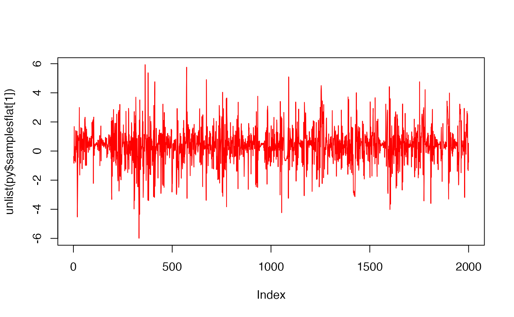

```{r setup, include = FALSE}
# Check if running on GitHub Actions
# This is important as otherwise Github will attempt to build this and it's missing the python libraries and will fail
on_github <- Sys.getenv("GITHUB_ACTIONS") == "true"

# If on GitHub, set eval = FALSE for all subsequent chunks
knitr::opts_chunk$set(eval = !on_github)
```

```{r, include = FALSE}
knitr::opts_chunk$set(
  collapse = TRUE,
  comment = "#>"
)
```
---
## Bayesian 
ddd
### dddd

```{r rsetup, include=TRUE,echo=FALSE}
plot(1:10)
```

```{r, echo=FALSE}
# This ensures knitr tracks the image as a dependency
#
```

```{r rsetup2, include=TRUE,echo=FALSE}
plot(density(rnorm(1e5)))
```


